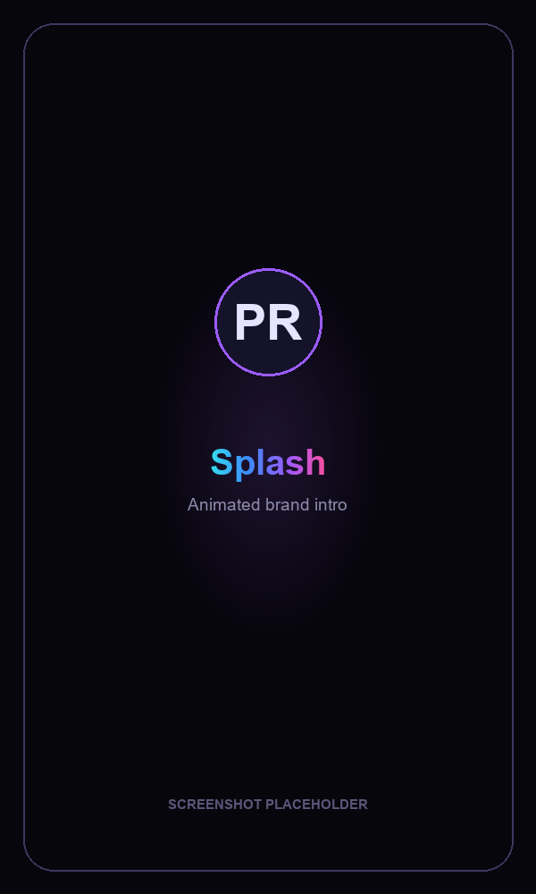
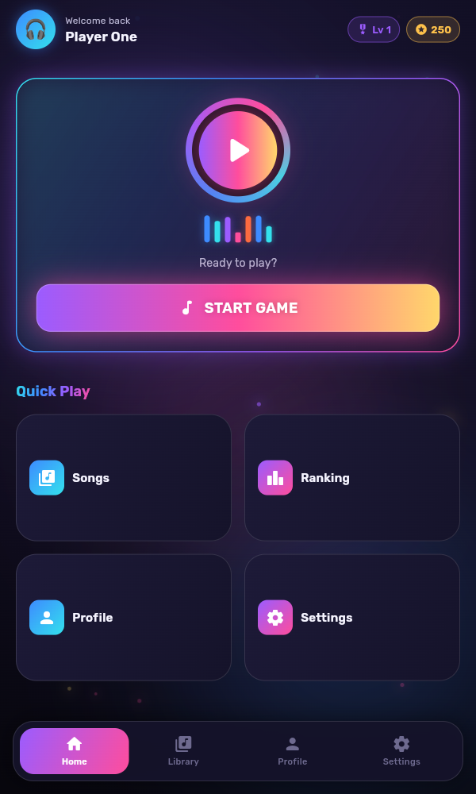
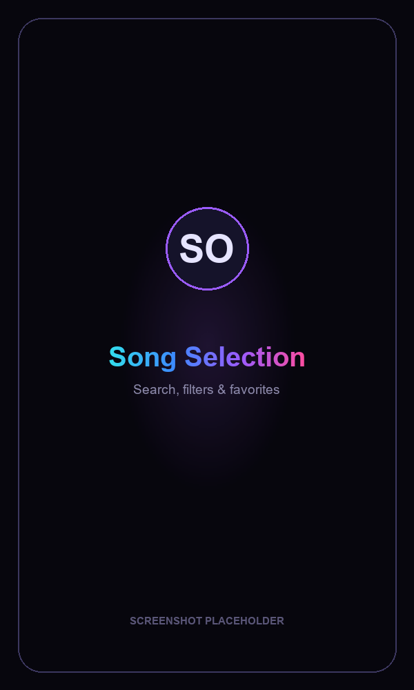
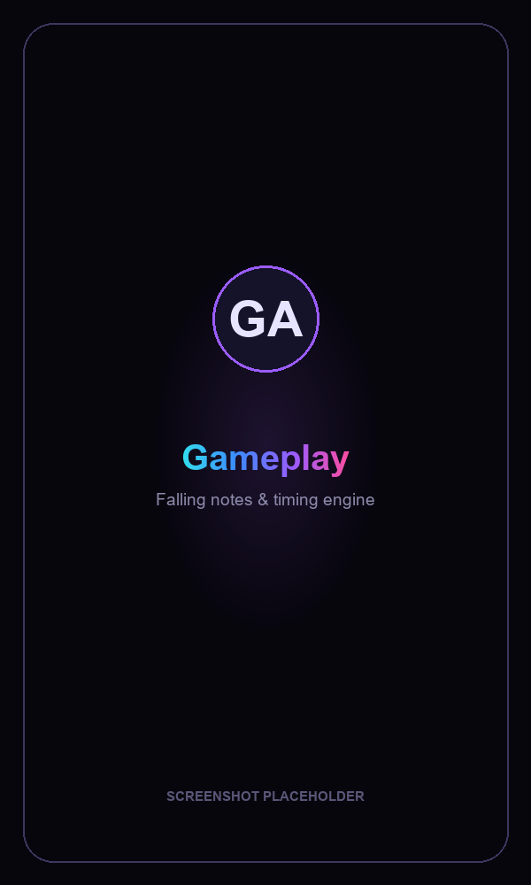
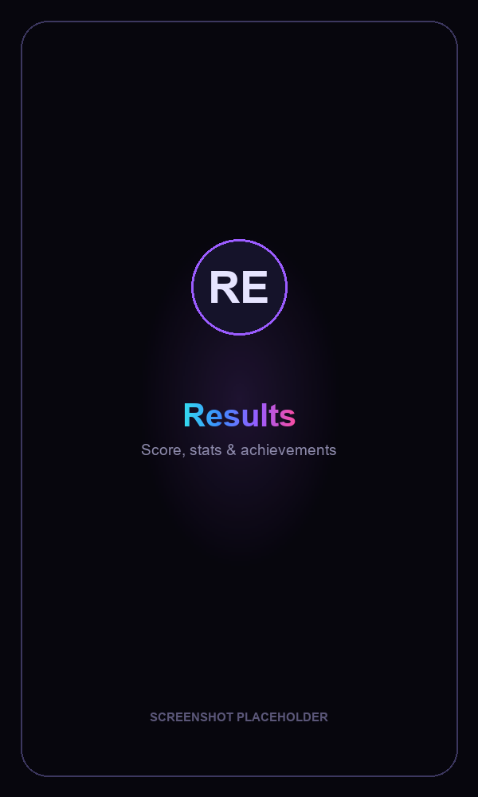
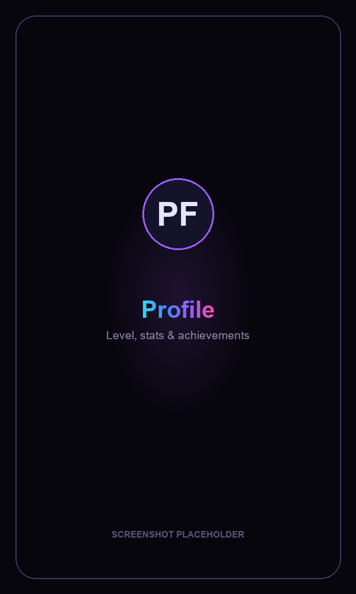
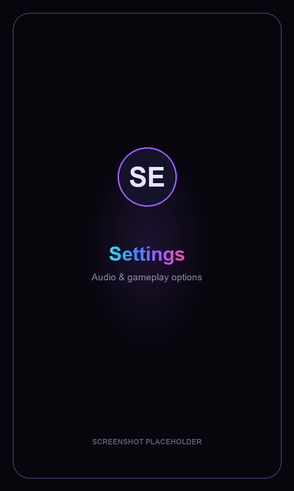

<div align="center">

# 🎹 Piano Rhythm Master

### A premium mobile rhythm piano game built with Flutter

Tap appearing piano notes in time with the music. Chain combos, chase accuracy, level up, and climb the ranks — wrapped in a dark, neon, glass-morphic UI with fluid animations.


</div>

---

## 📸 Screenshots

<div align="center">

| Splash | Home | Song Selection |
| :---: | :---: | :---: |
|  |  |  |

| Gameplay | Results | Profile |
| :---: | :---: | :---: |
|  |  |  |

| Settings |
| :---: |
|  |

</div>

> ℹ️ Some images above are placeholders. The Home screen is a real capture; regenerate the rest anytime — see [Capturing screenshots](#-capturing-screenshots).

---

## ✨ Features

- 🎬 **Animated splash** — glowing logo, shimmering gradient wordmark, smooth transition
- 🏠 **Home hub** — level & coins, pulsing play button in a rotating conic-gradient ring, animated equalizer, quick-play grid
- 🎵 **Song library** — search, category & difficulty filters, favorites, per-song best scores, colored difficulty badges (Easy/Normal/Hard/Expert)
- 🎮 **Core gameplay** — five glowing lanes (C·D·E·F·G), gem-like falling notes with comet trails, lane light columns, hit-burst particles, real piano tones on every tap
- 🏁 **Results** — animated score count-up, rank medallion, star rating, full accuracy breakdown, confetti, achievement popups
- 👤 **Profile & progression** — XP/levels, coins, songs played, best score/combo/accuracy, unlockable achievements, editable avatar & name
- ⚙️ **Settings** — music & SFX volume, vibration, note speed, difficulty, left-hand mode, account login/logout
- 🏆 **Ranking** — local leaderboard of best runs (architected to become an online leaderboard)
- 🎨 **Design system** — dark theme, neon + gold accents, glassmorphism, animated aurora background with floating particles, gradient titles

---

## 🎯 Gameplay Mechanics

**Timing windows** — how close your tap must land to the note:

| Judgment | Window | Base Score |
| :--- | :--- | :--- |
| 🩵 Perfect | ±50 ms | +100 |
| 💚 Great | ±100 ms | +70 |
| 💛 Good | ±200 ms | +40 |
| ❤️ Miss | > 200 ms | 0 |

**Combo multiplier** — reward for consecutive hits:

| Combo | Multiplier |
| :--- | :--- |
| 10+ | ×1.2 |
| 50+ | ×1.5 |
| 100+ | ×2.0 |

**Accuracy** is a weighted average of your judgments; **rank** (S/A/B/C/D) and **stars** (0–3) are awarded from final accuracy.

---

## 🧱 Tech Stack

| Concern | Choice |
| :--- | :--- |
| Framework | Flutter (Material 3) |
| Language | Dart |
| State management | `provider` |
| Local persistence | `shared_preferences` |
| Audio | `audioplayers` (polyphonic pool) |
| Animations | `flutter_animate`, `confetti`, custom painters |
| Fonts | Rubik (bundled) |

---

## 🏛️ Architecture

The app is **local-first but Firebase-ready**. All data flows through a single `GameRepository` interface, so the on-device implementation used today can be swapped for a Firestore-backed one without touching the UI or game logic.

```
UI (screens/widgets)
        │
   Providers  ──►  SettingsProvider · ProfileProvider · GameController (real-time engine)
        │
 GameRepository (interface)  ◄── swap point for Firebase
        │
 LocalGameRepository  ──►  shared_preferences + bundled songs
```

The data models mirror the spec's Firebase collections one-to-one:

| Model | Firebase collection |
| :--- | :--- |
| `UserProfile` | `Users` |
| `Song` / `NoteEvent` | `Songs` (with `beat_map`) |
| `ScoreResult` | `Scores` |

**To go online:** implement `GameRepository` with `cloud_firestore`, register it in `main.dart`, and the rest of the app works unchanged.

### Project structure

```
lib/
├── main.dart                 # bootstrap: prefs, audio, repository, runApp
├── app.dart                  # providers, MaterialApp, page transitions
├── theme/
│   └── app_theme.dart        # colors, gradients, spacing, ThemeData
├── models/                   # Song, NoteEvent, ScoreResult, UserProfile, Achievement
├── data/
│   ├── game_repository.dart       # storage interface (Firebase-ready)
│   ├── local_game_repository.dart # shared_preferences implementation
│   └── seed_songs.dart            # demo songs + procedural beat-map generator
├── services/
│   └── audio_service.dart    # polyphonic piano-tone playback
├── state/
│   ├── settings_provider.dart
│   ├── profile_provider.dart
│   └── game_controller.dart  # timing, scoring, combo, notes (the engine)
├── widgets/                  # SongCard, PianoButton, ScoreDisplay, FallingNote,
│                             # GlowButton, GlassCard, GradientText, HitBurst, ...
└── screens/                  # Splash, MainShell, Home, SongSelection, Game,
                              # Result, Profile, Settings, Ranking
assets/
├── fonts/                    # Rubik
└── sounds/                   # synthesized piano tones (note_c4.wav … note_c5.wav)
```

---

## 🚀 Getting Started

### Prerequisites
- [Flutter SDK](https://docs.flutter.dev/get-started/install) 3.44+ (Dart 3.12+)
- Chrome (for web) or an Android/iOS device or emulator

### Install & run

```bash
flutter pub get

# Web (fastest to preview)
flutter run -d chrome

# Android
flutter run -d <android-device-id>
```

> **Behind a proxy?** If `flutter pub get` fails fetching Git dependencies, clear the proxy for the command (e.g. `HTTP_PROXY= HTTPS_PROXY= flutter pub get`).

---

## 🎧 Audio & Songs

There are no licensed tracks bundled. Instead, piano tones are **synthesized WAVs** and each song ships an original, **procedurally generated beat map** (`lib/data/seed_songs.dart`). When you hit notes accurately, the melody plays back through your taps — Piano-Tiles style.

To add a real track: drop the audio into `assets/`, set `Song.audioFile`, and provide a hand-authored `beat_map` (list of `NoteEvent{time, lane}`). The model already supports it.

---

## 📷 Capturing screenshots

The app supports a screenshot deep-link so every screen can be reached directly (used to regenerate the images above):

```
http://localhost:<port>/?shot=splash | home | library | game | result | profile | settings
```

Run the web build, open a URL above, and capture. Replace the files in `screenshots/` (keep the same names) and the README updates automatically.

---

## 🗺️ Roadmap

- [ ] Firebase Auth + Firestore (cloud profiles & sync)
- [ ] Online leaderboards & multiplayer battles
- [ ] User-uploaded songs & AI-generated beat maps
- [ ] Automatic difficulty generation
- [ ] In-app purchases & cosmetics
- [ ] Real backing-track audio

---

## 📄 License

MIT — free to use, learn from, and build upon.

<div align="center">

**Built with Flutter** · Tap. Time. Triumph. 🎹

</div>
